# Quasi-Monte Carlo (QMC) 

\begin{equation*}
\overbrace{\Ex[f(\vX)] = \int_{[0,1]^d} f(\vx) \, \dif \vx}^{\alerttextsf{population mean}} 
\approx \underbrace{\frac 1n \sum_{i=0}^{n-1} f(\vx_i)}_{\alerttextsf{sample mean}}, \qquad \text{where }\vX \sim \Unif([0,1]^d)
\end{equation*}


Desire

- [Approximation]{.alert}: $\displaystyle \frac 1n \sum_{i=0}^{n-1} f(\vx_i)$

- Deterministic or probabilistic [estimate/bound]{.alert} on error: $\displaystyle\Biggl \lvert \int_{[0,1]^d} f(\vx) \, \dif \vx - \frac 1n \sum_{i=0}^{n-1} f(\vx_i) \Biggr \rvert$

- [Economical computational cost]{.alert}: $\Order \bigl( n \, \$(f) + n^p \bigr)$ 
  - $\$(f)$ is cost of evaluating $f$ once
  - $\Order(n^p)$ is the cost of the error estimate/bound


## QMC has grown over several decades

::: {.columns}

::: {.column width="35%"}
\begin{multline*}
\overbrace{\Ex[f(\vX)] = \int_{[0,1]^d} f(\vx) \, \dif \vx}^{\alerttextsf{population mean}} \\
\approx \underbrace{\frac 1n \sum_{i=0}^{n-1} f(\vx_i)}_{\alerttextsf{sample mean}}
\end{multline*}

* [Practice]{.alert}
  - Motivates and illustrates theory 
  - Solves real problems

* [Theory]{.alert} justifies and explains practice


* [Foundation]{.alert} enables theory


:::

::: {.column .tree-col width="65%"}

```{python}
#| echo: false
#| output: asis

import runpy

helper = runpy.run_path(
    "../classlib/classlib/quarto/assets/images/qmc-tree/render_qmc_tree.py"
)

helper["render_qmc_tree"](
    show_group_labels=True,
)
```

:::

:::


## No QMC with roots only

::: {.columns}

::: {.column width="35%"}

\begin{multline*}
\overbrace{\Ex[f(\vX)] = \int_{[0,1]^d} f(\vx) \, \dif \vx}^{\alerttextsf{population mean}} \\
\approx \underbrace{\frac 1n \sum_{i=0}^{n-1} f(\vx_i)}_{\alerttextsf{sample mean}}
\end{multline*}

&nbsp;

&nbsp;

&nbsp;

* [Foundation]{.alert} enables theory

  - Rooted in multiple disciplines 
  - Rare for a single person to have expertise in all of them

:::

::: {.column .tree-col width="65%"}

```{python}
#| echo: false
#| output: asis


helper["render_qmc_tree"](
    groups=["foundation"],
    group_labels=["foundation"],
    mask="root",
)
```

:::

:::

## A strong trunk supports the canopy

::: {.columns}

::: {.column width="35%"}

\begin{multline*}
\overbrace{\Ex[f(\vX)] = \int_{[0,1]^d} f(\vx) \, \dif \vx}^{\alerttextsf{population mean}} \\
\approx \underbrace{\frac 1n \sum_{i=0}^{n-1} f(\vx_i)}_{\alerttextsf{sample mean}}
\end{multline*}


&nbsp;

* [Theory]{.alert} 

  - Draws on the foundation
  
  - Explains what may and may not work

  - Grows in response to suprises in practice

:::

::: {.column .tree-col width="65%"}

```{python}
#| echo: false
#| output: asis

helper["render_qmc_tree"](
    groups=["theory"],
    group_labels=["theory"],
    mask="canopy",
)
```

:::

:::


## Canopy is the most visible

::: {.columns}

::: {.column width="35%"}

* [Practice]{.alert}
  - Solving problems with societal impact
  - Infrastructure for practitioners
  - Requires theory for justification
  - May not seem to align with theory at first

::: {.fragment .main-message}

Need to be aware of [all]{.alert} parts of the tree

:::

:::

::: {.column .tree-col width="65%"}

```{python}
#| echo: false
#| output: asis

helper["render_qmc_tree"](
    groups=["practice"],
    group_labels=["practice"],
)
```

:::

:::

# Illustrative Bayesian uncertainty quantification example

::: {.columns}

::: {.column width="60%"}

- [Noisy]{.alert} data
  - $y_m = g(\xi_m) + \epsilon_m$, $m = 1, \ldots, M$,
    $\epsilon_1, \ldots, \epsilon_M \IIDsim \Norm(0,\sigma^2)$
  
  - $g : [0,1] \to \reals$ [unknown]{.alert} <br> modeled by Gaussian process

  - $\vg=(g(t_1),\dots,g(t_d)) \implies \vg \mid \vy \sim \Norm(\vmu_d,\mSigma_d)$

- Quantity of interest [(QOI)]{.alert}
  $\displaystyle \Ex\Bigl[ \bigl(J(g)\bigr)^2 \mid \vy \Bigr]$

- [Spatial risk/penalty]{.alert} <br> $\displaystyle J(g)= \int_0^1\int_0^1 \max\bigl(g(t)-\tau,0 \bigr)^2 \,\dif t$ <br> $\tau =$ threshold

:::

::: {.column .tree-col width="40%"}

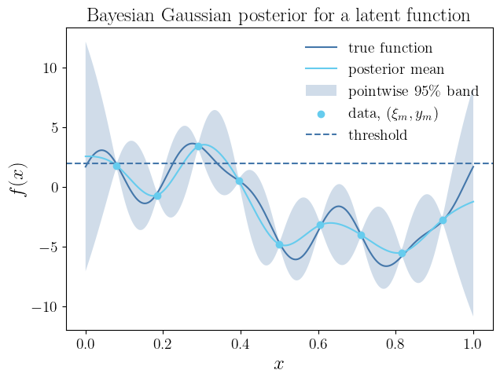{width=100%}

```{python}
#| echo: false
#| output: asis

helper["render_qmc_tree"](
    labels=["sequence", "discrepancy", "uq", "infer", "random"],
    tree_font_scale=1.5,
    tree_width="75%",
)
```

:::

:::


## Illustrative Bayesian uncertainty quantification example

::: {.columns}

::: {.column width="60%"}

- [Noisy]{.alert} data
  - $y_m = g(\xi_m) + \epsilon_m$, $m = 1, \ldots, M$,
  
  - $g : [0,1] \to \reals$ [unknown]{.alert}

  - $\vg=(g(t_1),\dots,g(t_d)) \implies \vg \mid \vy \sim \Norm(\vmu_d,\mSigma_d)$

- Quantity of interest [(QOI)]{.alert}
  $\displaystyle \Ex\Bigl[ \bigl(J(g)\bigr)^2 \mid \vy \Bigr]$

- [Spatial risk/penalty]{.alert} 
  \begin{multline*}
  J(g)= \int_0^1 \max\bigl(g(t)-\tau,0 \bigr)^2  \, \dif t 
 \\
  \approx J_d(\vg)
  :=
  \sum_{j=1}^d w_j \max\bigl(g(t_j)-\tau,0 \bigr)^2
  \end{multline*}
:::

::: {.column width="40%"}

{width=100%}

:::

:::

::: {style="margin-top:-2em;"}
  $$
  \alerttextsf{QOI}
  \approx
  \int_{\reals^d} \bigl(J_d(\vg)\bigr)^2
  \phi_d(\vg;\vmu_d,\mSigma_d)
  \,\dif \vg
  \overset{\alerttextsf{transform}}=
  \int_{[0,1]^d} f(\vx)\,\dif \vx
  \approx
  \frac1n\sum_{i=1}^n f(\vx_i)
  $$
:::

## Performance for IID and Sobol' sequences

::: {.columns}

::: {.column width="50%" style="text-align:center;"}

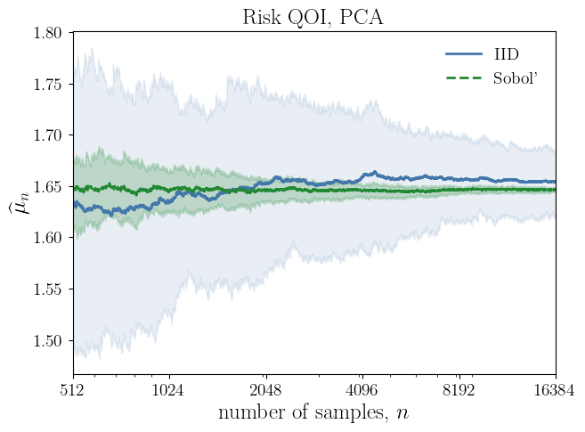{width=100%}

:::

::: {.column width="50%" style="text-align:center;"}

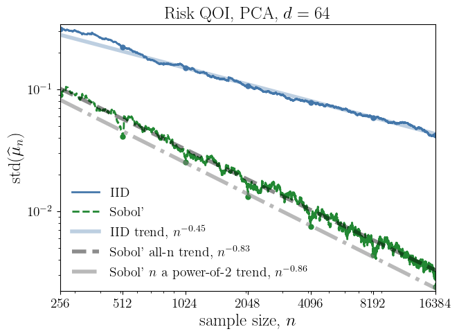{width=100%}


:::

:::

::: {style="display:flex; flex-direction:column; align-items:center; margin-top:-0.5em;"}

::: {style="display:inline-block; width:60%;"}



:::

:::

## Why did we use PCA and not Cholesky?

::: {.columns}

::: {.column width="65%"}

[Multiple]{.alert} transformations map a Gaussian integral to a standard uniform integral

::: {.fragment .main-message}

[Transformation]{.alert} from your distribution to standard uniform affects performance

:::

:::

::: {.column .tree-col width="35%"}

::: {style="position: relative; top: -3.5em; z-index:9999;"}
```{python}
#| echo: false
#| output: asis

helper["render_qmc_tree"](
    labels=["sequence", "discrepancy", "uq", "infer", "change-measure", "random"],
    tree_font_scale=1.3,
)
```

:::

::: 

:::

::: {style="margin-top:-4em;"}

:::

::: {.columns}

::: {.column width="50%" style="text-align:center;"}

{width=100%}

:::

::: {.column width="50%" style="text-align:center;"}

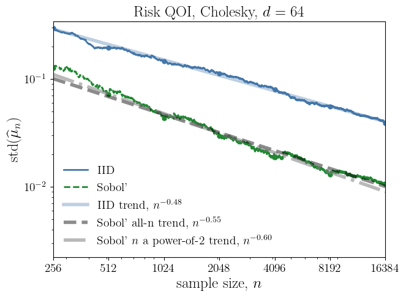{width=100%}


:::

:::

## Considerations

### This example 

- Simple, but not overly simple

- Cost of function values rather small compared to many realistic applications

- Sample size rather large

- Meant to be illustrative, not definitive

### Important matters that we do not discuss

- How to choose the [covariance kernel]{.alert} (Matèrn $3/2$ in this case) of the hyperparameters

- The effect of choosing different $t_1, \ldots, t_d$ or quadrature weights (trapezpoidal rule)

- Potential speedup from [multilevel]{.alert} methods


# QMC is impressive, why not more so? 

::: {.columns}

::: {.column width="65%"}

- Our $f$ is rather smooth

- Why not $\Order(n^{-3/2+\delta})$ convergence []() rather than  $\Order(n^{-1+\delta})$ convergence?

  - Our integrand [seems]{.alert} smooth

  - Dimension is [not small]{.alert}


::: {.fragment data-fragment-index="1"}
Look at $\displaystyle\int_{[0,1]^d} 3 \lVert \vx \rVert^2/d \; \dif \vx=1$ ([additive integrand]{.alert})
:::

:::

::: {.column .tree-col width="35%"}

::: {style="position: relative; top: -3.5em; z-index:9999;"}

```{python}
#| echo: false
#| output: asis

helper["render_qmc_tree"](
    labels=["sequence", "error", "change-measure", "uq", "infer", "random"],
    tree_font_scale=1.3,
)
```
:::

:::

:::

::: {.fragment data-fragment-index="1" style="margin-top:-1em;"}

::: {.columns}

::: {.column width="50%" style="text-align:center;"}

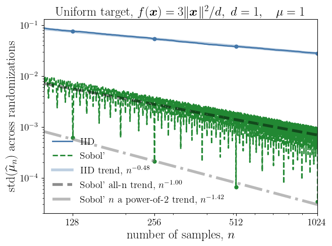{width=75%}

:::

::: {.column width="50%" style="text-align:center;"}

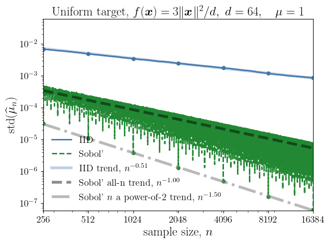{width=75%}

:::

:::

:::

---

Look at $\displaystyle\int_{[0,1]^d} \frac{\lVert \vx \rVert^2}{d} \, \frac{\exp(-\lVert \vx \rVert^2/2)}{(2 \pi)^{d/2}} \, \dif \vx=1$ ([additive integrand]{.alert})

::: {.columns}

::: {.column width="50%" style="text-align:center;"}

{width=100%}

:::

::: {.column width="50%" style="text-align:center;"}

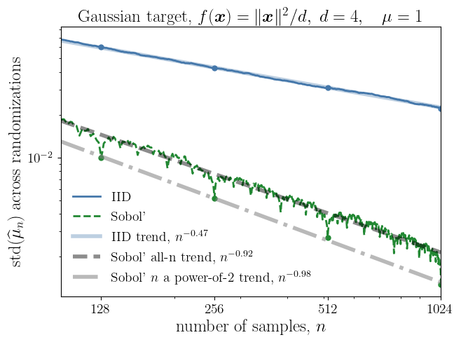{width=100%}

:::

:::

- Change of measure might affect smoothness

---

### Can importance sampling help? 

- Pinch off the roughness at the boundary

- After importance sampling, integrand no longer additive

::: {.columns}

::: {.column width="50%" style="text-align:center;"}

{width=100%}

:::

::: {.column width="50%" style="text-align:center;"}

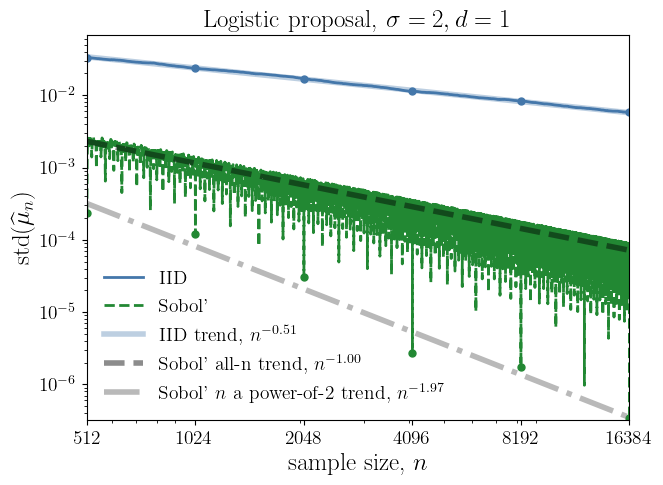{width=100%}

:::

:::

---

::: {.columns}

::: {.column width="50%" style="text-align:center;"}

{width=100%}

:::

::: {.column width="50%" style="text-align:center;"}

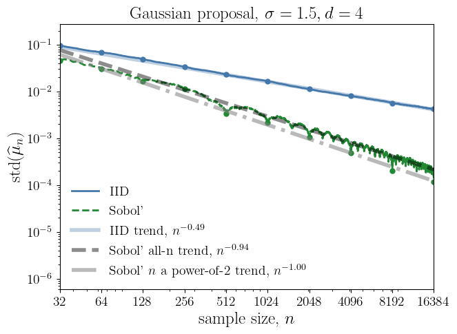{width=100%}

:::

:::

:::{.main-message}

Importance sampling can help, but not a panacea and may not recover the desired convergence rate

:::

# Low Discrepancy Sequence Constructions

::: {.columns}

::: {.column width="65%"}

\begin{multline*}
\left\lvert \int_{[0,1]^d} f(\vx) \, \dif \vx - \frac{1}{n} \sum_{i=0}^{n-1} f(\vx_i) \right\rvert
\\ \le \underbracket{\Dsc\bigl(\{\vx_i\}_{i=0}^{n-1}\bigr)}_{\substack{\alerttextsf{Discrepancy} \\ \Order(\alert{n^{-1+\delta}}) \textsf{ or } \alerttextsf{better}}} \, \lVert f \rVert_{\cf} \ \mathlink{https://link.springer.com/chapter/10.1007/978-3-032-10590-5_1}{\textsf{HKS26}}
\end{multline*}
<!-- \yamlref{hickirsor_2026_qmc_tutorial} -->

::: {.fragment}

Careful choices of $\vx_0, \vx_1, \ldots$ lead to low discrepancy:

- [Digital sequences]{.alert} []()
- [Lattice sequences]{.alert} []()
- [Halton]{.alert} []()
- [Kronecker sequences]{.alert} []()
- [Optimization and neural network based]{.alert} [](), []() 

:::

:::


::: {.column .tree-col width="35%"}

::: {style="position: relative; top: -3.5em; z-index:9999;"}

```{python}
#| echo: false
#| output: asis

helper["render_qmc_tree"](
    labels=["sequence", "discrepancy", "missing", "random"],
    tree_font_scale=1.5,
)
```

::: {.fragment}

- Extensible sequences facilitate adaptive error control

- Number theory or component-by-component (CBC) constructions []()

- Digital and lattice sequences have preferred $n = 1, b, b^2, \ldots$

- Randomization removes bias and points on the boundary

:::

:::

:::

:::

## Missing samples by design or by accident

::: {.columns}

::: {.column width="65%"}

### Problem

- Some QMC software intentionally

  - Omits $\vzero = (0,0,\ldots)$ because it is on the boundary

  - Facilitates skipping points or starting at a later point in the sequence

- $f(\vx_i)$ might be NaN or $\infty$ for some $i$?

- Breaks the net or lattice structure

::: {.fragment}

### Solution 1

Persuade the software developers to 

- Not omit or skip points 

- Randomize to get points off the boundary

:::

:::

::: {.column .tree-col width="35%"}

::: {style="position: relative; top: -3.5em; z-index:9999;"}

```{python}
#| echo: false
#| output: asis

helper["render_qmc_tree"](
    labels=["sequence", "discrepancy", "missing", "random", "software"],
    tree_font_scale=1.5,
)
```
:::{.fragment}

### Solution 2

- If time allows, use [optimal sample weights]{.alert} with the samples that you have, but may required $\Order(n^3)$ extra work

- Construct sequences that are good for all $n$

- Be [happy]{.alert} with $\Order(n^{-1+\delta})$ convergence

:::

:::

:::

:::


## Sequences that are good for all $n$

- []() and []() show that [lattice sequences]{.alert} are not bad for arbitrary $n$, even when the generators are chosen for $n=b^m$

\begin{align*}
\vx_i &= \phi_b(i) \vzeta + \vDelta \bmod \vone \\
\boldsymbol{\zeta} & \in \mathbb{N}^d, \quad \boldsymbol{\Delta} \in [0,1)^d\\
\phi_b\bigl((\cdots i_2 i_1 i_0)_{b} \bigr) & = {}_b0.i_0 i_1 i_2 \cdots \\
\phi_2(6)  = \phi_2\bigl((110)_2\bigr) & = {}_20.011 = 0.375 = 3/8
\end{align*}

- []() have new resuts on [Kronecker sequences]{.alert}

\begin{align*}
\vx_i &= i\boldsymbol{\zeta} + \boldsymbol{\Delta} \bmod \boldsymbol{1} \\
\boldsymbol{\zeta}, \boldsymbol{\Delta} & \in [0,1)^d\\
\end{align*}

---

### CBC to construct lattice and Konecker sequences that are good for all $n$
\begin{gather*}
\operatorname{WSSD}(N) = \sum_{i=1}^{N} n \, \Ex_{\vDelta}\bigl[\Dsc^2\bigl(\{\vx_i + \vDelta \bmod \vone\}_{i=0}^{n-1}\bigr) \bigr] \\
\text{Choose } \cf \text{ so that } \Ex_{\vDelta}\bigl[\Dsc^2\bigl(\{\vx_i + \vDelta \bmod \vone\}_{i=0}^{n-1}\bigr)\bigr] \text{ costs } \Order(dN) \text{ operations}
\end{gather*}

:::{.fragment}

::: {.columns}

::: {.column width="40%"}

Computational cost

- $\Order(d N \log(N))$ for [lattice]{.alert}

- $\Order(d N M)$ for [Kronecker]{.alert} <br>where $M$ size of the candidate set

:::

::: {.column .tree-col width="60%"}

:::{style="text-align:center;"}
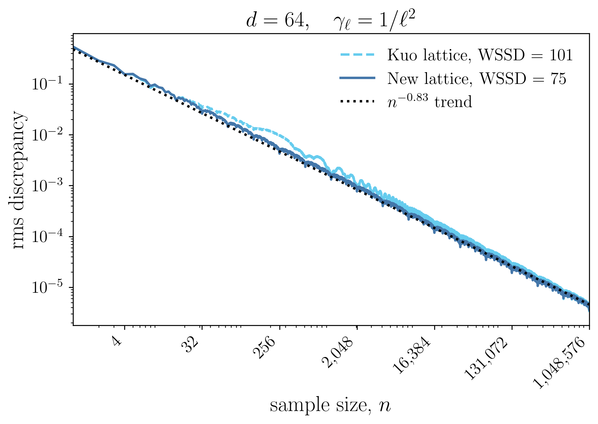{width=90%} 
:::

:::

:::

:::

## Our UQ example for various low discrepancy sequences

::: {.columns}

::: {.column width="50%" style="text-align:center;"}

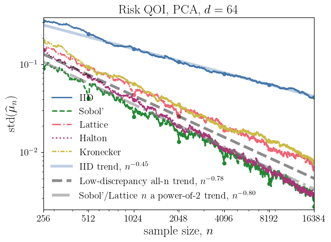{width=100%}

:::

::: {.column width="50%" style="text-align:center;"}



:::

:::

::: {.main-message}

All low discrepancy sequences outperformed IID sampling, but no univerisal winner

:::

## About those missing samples

::: {.columns}

::: {.column width="50%" style="text-align:center;"}

{width=100%}

:::

::: {.column width="50%" style="text-align:center;"}

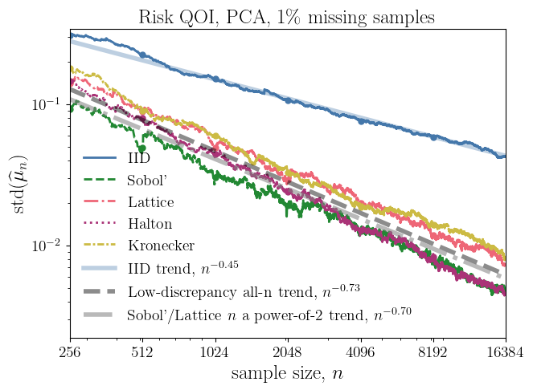{width=100%}

:::

:::

--- 

::: {.columns}

::: {.column width="50%" style="text-align:center;"}

{width=100%}

:::

::: {.column width="50%" style="text-align:center;"}

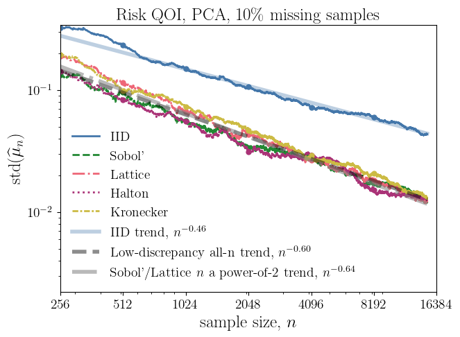{width=100%}

:::

:::


# Data-driven error bounds

# Software Development and Dissemination

::: {.columns}

::: {.column width="65%"}

A number of software packages have been developed to make QMC methods more accessible to practitioners ([more detail](https://fjhickernell.github.io/MCQMC26/pages/qmc-software.html))

- Implementations of various low discrepancy sequences
- Error estimation 
- Interfaces to applications and related algorithms

:::

::: {.column .tree-col width="35%"}

```{python}
#| echo: false
#| output: asis

helper["render_qmc_tree"](
    labels=["community", "ai", "software"],
    tree_font_scale=1.5,
)
```
:::


:::

```{python}
#| echo: false
#| output: asis


helper_software = runpy.run_path("../qmcsoftware/scripts/qmc_software_table.py")

helper_software["render_qmc_software_table"](
    "../qmcsoftware/data/qmc-software.yml",
    mode="slides",
    start=0,
    stop=6,
)
```

---

```{python}
#| echo: false
#| output: asis

helper_software["render_qmc_software_table"](
    "../qmcsoftware/data/qmc-software.yml",
    mode="slides",
    start=6,
    stop=18,
)

```

---

```{python}
#| echo: false
#| output: asis


helper_software["render_qmc_software_table"](
    "../qmcsoftware/data/qmc-software.yml",
    mode="slides",
    start=18,
    stop=34,
)

```

## The why and what of QMC software?

### We need to

- [Demonstrate]{.alert} that the theory explains performance on problems that matter
- Make QMC methods more [accessible]{.alert} to practitioners
- [Discover]{.alert} new applications and need for new theory
- Preserve [memory]{.alert} of what can be done

::: {.fragment}

### The ideal QMC software ecosystem:

- [Correct]{.alert}

- [Efficient]{.alert}

- [User-friendly]{.alert}, including [documentation]{.alert} and examples

- [Error estimation]{.alert} and [diagnostics]{.alert}

- [Test-bed]{.alert} of problems for bencmarking and demonstration

- [Interfaces]{.alert} to applications and related algorithms

- Adheres to best [software engineering]{.alert}  practices, including unit/doctests and version control

- Owned by a [community]{.alert} of users and developers

:::


## Thanks to my many collaborators

```{python}
#| echo: false
#| output: asis

import yaml
from pathlib import Path

people = yaml.safe_load(
    Path("../data/collaborators.yml").read_text()
)

def render_collaborators(
    highlight_slugs=None,
    ncols=5,
    img_width="135px",
):
    highlight_slugs = set(highlight_slugs or [])

    print(
        f'<div class="collab-grid" '
        f'style="grid-template-columns: repeat({ncols}, 1fr);">'
    )

    for person in people:
        slug = person["slug"]
        caption = person["caption"]
        img = f"../assets/img/headshots/processed/{slug}.jpg"

        if len(highlight_slugs) == 0:
            card_class = "collab-card"
        elif slug in highlight_slugs:
            card_class = "collab-card highlight"
        else:
            card_class = "collab-card dim"

        print(f"""
<div class="{card_class}">
  
  <div class="collab-caption">{caption}</div>
</div>
""")

    print("</div>")

render_collaborators()
```

---

::: {style="margin-top:-1.5em;"}

:::

### Lead QMCPy developers
```{python}
#| echo: false
#| output: asis
#| 
render_collaborators(
    highlight_slugs={
        "sorokin-aleksei",
        "choi-sou-cheng",
    }
)
```

---

::: {style="margin-top:-1.5em;"}

:::

### Nathan added MPMC,  Art got more bits, Pieterjan added MLMC, Yifei made code faster
```{python}
#| echo: false
#| output: asis
#| 
render_collaborators(
    highlight_slugs={
        "xiong-yifei",
        "owen-art",
        "robbe-pieterjan",
        "kirk-nathan",
    }
)
```

---

::: {style="margin-top:-1.5em;"}

:::

### PhD/MS/BS/high school/summer/Monte Carlo class students/alumni
```{python}
#| echo: false
#| output: asis
#| 
render_collaborators(
    highlight_slugs={
        "dave-karm", "jagadesswaran-r","kang-jiangrui","matiukha-larysa","sorokin-aleksei","sharp-brandon","varela-richard","pride-anders","vemuri-laasya-priya", "jain-aadit","jagadeeswaran-rathinavel"
        
    }
)
```
## One other tireless collaborator

Has assisited me in preparing this talk an in my research in general, especially within the last year or so 

::: {style="position:absolute; bottom:20px; left:505px; font-size:2.5em; z-index:9999;"}
[⬇]{.alert}
:::

::: {.fragment}

AI used well

- Accelerates good sofware development, including
  - Code generation from prompts or research papers

    _Alex Keller: "Let me show you how to use AI to generate a QMC package in Python in minutes."_

    _Sou-Cheng Choi: "Some good news about the baby Julia package [ported from QMCPy recently]. It seems to be running in 1/3 time and 1/2 memory of Python over a benchmarking suite of problems."_

  - Code refactoring for hygiene and optimization

    _Art Owen: "Claude has spotted ways for me to speed up rsobol, and also get better code hygiene.  Maybe 30 to 40x speedup."_

  - Code review and debugging
  - Documentation
  - Unit tests and doctests
  - Explanation
  
:::

# Main messages




# Future directions

::: {.columns}

::: {.column width="35%"}

* [Practice]{.alert}
  - Solving problems with societal impact
  - Infrastructure for practitioners
  - Requires theory for justification
  - May not seem to align with theory at first

:::

::: {.column .tree-col width="65%"}

```{python}
#| echo: false
#| output: asis


helper["render_qmc_tree"](
    groups=["foundation", "theory", "practice"],
    group_labels=["foundation", "theory", "practice"],
)
```

:::

:::


# References {#references}

```{python}
#| echo: false
#| output: asis

import sys
from pathlib import Path

sys.path.insert(0, str(Path("../classlib").resolve()))

from classlib.quarto.references.render_references import render_reference_slides

render_reference_slides(
    deck_path="Plenary_MCQMC2026.qmd",
    refs_path="../classlib/classlib/quarto/metadata/hickernell-papers.yml",
    max_lines=30,
    wrap_width=92,
)
```
