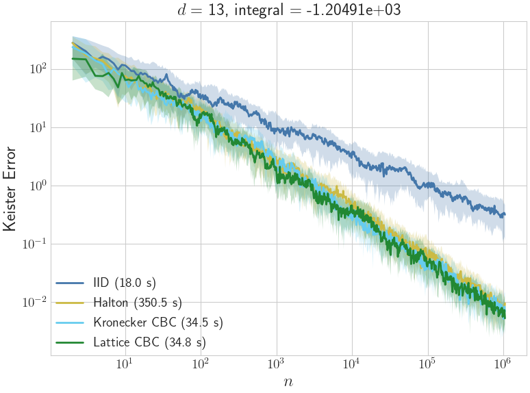

# What quasi-Monte Carlo (QMC) does w/ low discrepancy sequences {#what-qmc-does}



:::{.columns}

::: {.column width="49%"}

For $\vx_0, \vx_1, \ldots \,\alert{\IIDsim}\, \Unif[0,1]^d$
\begin{multline*}
\sqrt{\Ex\left[ \left( \int_{[0,1]^d} f(\vx) \, \dif \vx - \frac{1}{n} \sum_{i=0}^{n-1} f(\vx_i) \right)^2 \right]} \\
= \alert{n^{-1/2}} \std(f)
\end{multline*}

:::

::: {.column width="2%"}
&nbsp;
:::

::: {.column width="49%" .fragment fragment-index="1"}

For [carefully]{.alert} chosen $\vx_0, \vx_1, \ldots \,\alert{\LDsim}\, \Unif[0,1]^d$
\begin{multline*}
\left\lvert \int_{[0,1]^d} f(\vx) \, \dif \vx - \frac{1}{n} \sum_{i=0}^{n-1} f(\vx_i) \right\rvert
\\ \le \underbracket{\Dsc\bigl(\{\vx_i\}_{i=0}^{n-1}\bigr)}_{\Order(\alert{n^{-1+\delta}}) \text{ or \class{alert}{better}}} \, \lVert f \rVert_{\cf} \ \href{https://arxiv.org/abs/2502.03644}{\text{HKS26}}
\end{multline*}

:::

:::

:::{.columns}

::: {.column width="49%"}

```{python}
#| echo: false
#| fig-width: 4
#| fig-height: 4
#| fig-align: center
n_list = [16, 25, 64]
fig, ax = qp.plot_proj(
    qp.IIDStdUniform(d),
    n=n_list,
    d_horizontal=d_horiz,
    d_vertical=d_vert,
    figfac=4.7,
    axis_pad=axis_pad,
    where_title=0.93,
    marker_size=ms,
    fig_title=rf"$n = {', '.join(map(str, n_list))}$"
)
fig.tight_layout()
```
:::

::: {.column width="2%"}
&nbsp;
::: 

::: {.column width="49%" .fragment fragment-index="1"} 
```{python}
#| echo: false
#| fig-width: 4
#| fig-height: 4
#| fig-align: center

n_list = [16, 25, 64]
fig, ax = qp.plot_proj(
    qp.Lattice(d),
    n=n_list,
    d_horizontal=d_horiz,
    d_vertical=d_vert,
    figfac=4.7,
    axis_pad=axis_pad,
    where_title=0.93,
    marker_size=ms,
    fig_title=rf"Lattice $n = {', '.join(map(str, n_list))}$"
)
fig.tight_layout()
```

:::

:::


## Problem {#problem}

::: {.columns}

::: {.column width="49%"}

### IID random sequences 
- [Extensible]{.alert}
  - Pause at any $n$ you like and add more points as needed
  - No problem if missing a few points here and there

- BUT [slow]{.alert} convergence: $\Order(n^{-1/2})$

:::

::: {.column width="2%"}
&nbsp;
::: 

::: {.column width="49%" .fragment fragment-index="1"}

### Low discrepancy (LD) sequences

- [Faster]{.alert} convergence: $\Order(n^{-1+\delta})$ for any $\delta > 0$

- BUT 
    - Normally _not_ easily extensible in $n$
      - [Lattices]{.alert} [](): $n = 1, b, b^2, \ldots$ 
      - [Digital nets]{.alert} []()  : $n = 1, b, b^2, \ldots$ 
      - [Halton]{.alert} [](): $n = 1, 2, 3, \ldots$ but bad projections in higher dimensions
      - [Kronecker]{.alert} [](): $n = 1, 2, 3, \ldots$ less studied
    - _Not_ robust to missing points
:::

:::

::: {.fragment fragment-index="2"}

### Want LD sequences that are _extensible_ in $n$ and _robust_ to missing points

- Cannot have $\Order(n^{-p})$ convergence with $p > 1$ for all $n$ 
- Need new constructions, error bounds, and stopping criteria

:::

## The sad and thrilling story of the missing $\vx_0$

:::{.columns}

::: {.column width="49%"}

### Some libraries/users drop $\vx_0 = (0,\ldots,0)$ in a LD sequence

- $(0,\ldots,0)$ looks too regular
- Transforming $\LDsim \Unif[0,1]^d$ to $\LDsim\Norm(\vzero,\mI)$ $0 \to -\infty$ 

:::{.fragment fragment-index="2"}
The cure is to [randomize]{.alert} the sequence, not to drop points
:::
 
:::

::: {.column width="2%"}
&nbsp;  
:::

::: {.column width="49%" .fragment fragment-index="1"}

### This is a bad idea; should keep $\vx_0$ to

- Maintain balance that ensures low discrepancy

- Preserve the structure that allows for error bounds and stopping criteria, especially for Sobol' and lattice sequences for $n = 1, b, b^2, \ldots$

The LD community urges users and libraries to keep $\vx_0$ in the sequence, [(SciPy, success)](https://docs.scipy.org/doc/scipy/reference/generated/scipy.stats.qmc.Sobol.html) and not to skip points [(MATLAB, not yet succeeded)](https://www.mathworks.com/help/stats/sobolset.html#btd9s8e-1) 
:::

:::

::: {.fragment fragment-index="3"}

But what if 

- There is [missing]{.alert} data, $f(\vx_{i_1}), f(\vx_{i_2}), \ldots, f(\vx_{i_{n_0}})$?  

- We [run out of budget]{.alert} before we reach the desired sample size?

:::


# The best we can hope for {#the-best-we-can-hope-for}

Building on []() we note that [(see the proofs)](#proofs)

&nbsp;

Suppose $\Dsc\bigl(\{\vx_i\}_{i=0}^{n_m-1}\bigr) \le C n_m^{-p}$ for a sequence of preferred sample sizes, $n_1, n_2, \ldots$: 

- If $p > 1$, then $n_{m+1} - n_m$ cannot be bounded

- If you lose/gain a bounded [number]{.alert} of _arbitrary_ data, i.e., $n = n_m \pm n_0$, then $\Dsc\bigl(\{\vx_i\}_{i=0}^{n-1}\bigr) = \Order\bigl(n_m^{-\min(p,1)}\bigr)$ 

  - If $p \le 1$, then you do not lose any thing asymptotically

  - If $p > 1$, then you still have $\Order(n_m^{-1})$ convergence

- If you lose/gain a bounded [proportion]{.alert} of data, $\alpha$, then $\Dsc\bigl(\{\vx_i\}_{i=0}^{n-1}\bigr) \lesssim \alpha$


# What we can do with lattice and Kronecker sequences {#what-we-can-do-with-lattice-and-kronecker-sequences}

::: {.columns}

::: {.column width="49%"}

<h3>Lattice sequences</h3>

\begin{align*}
\vx_i &= \phi_b(i) \vzeta + \vDelta \bmod \vone \\
\boldsymbol{\zeta} & \in \mathbb{N}^d, \quad \boldsymbol{\Delta} \in [0,1)^d\\
\phi_b\bigl((\cdots i_2 i_1 i_0)_{b} \bigr) & = {}_b0.i_0 i_1 i_2 \cdots \\
\phi_2(6)  = \phi_2\bigl((110)_2\bigr) & = {}_20.011 = 0.375 = 3/8
\end{align*}

:::

::: {.column width="2%"}
&nbsp;
:::


::: {.column width="49%"}  

<h3>Kronecker sequences</h3>

\begin{align*}
\vx_i &= i\boldsymbol{\zeta} + \boldsymbol{\Delta} \bmod \boldsymbol{1} \\
\boldsymbol{\zeta}, \boldsymbol{\Delta} & \in [0,1)^d\\
\end{align*}

:::

:::

:::{.columns}

::: {.column width="49%"}

```{python}
#| echo: false
#| fig-width: 4
#| fig-height: 4
#| fig-align: center
n_list = [16, 25, 64]
fig, ax = qp.plot_proj(
    qp.Lattice(d),
    n=n_list,
    d_horizontal=d_horiz,
    d_vertical=d_vert,
    figfac=4.7,
    axis_pad=axis_pad,
    where_title=0.93,
    marker_size=ms,
    fig_title=rf"$n = {', '.join(map(str, n_list))}$"
)
fig.tight_layout()
```
:::

::: {.column width="2%"}
&nbsp;
::: 

::: {.column width="49%"} 
```{python}
#| echo: false
#| fig-width: 4
#| fig-height: 4
#| fig-align: center
n_list.append(97)
fig, ax = qp.plot_proj(
    qp.Kronecker(d),
    n=n_list,
    d_horizontal=d_horiz,
    d_vertical=d_vert,
    figfac=4.7,
    axis_pad=axis_pad,
    where_title=0.93,
    marker_size=ms,
    fig_title=rf"Kronecker $n = {', '.join(map(str, n_list))}$"
)
fig.tight_layout()
```

:::

:::

## Discrepancies and (weighted) expected squared discrepancies
\begin{align*}
\Dsc^2\bigl(\{\vx_i\}_{i=0}^{n-1}, \cf \bigr) &:= \sup_{\lVert f \rVert_{\cf} \le 1 }\left \lvert \int_{[0,1]^d} f(\vx) \, \dif \vx - \frac 1n \sum_{i=0}^{n-1} f(\vx_i) \right \rvert^2 \\
 & = 
\int_{[0,1]^d \times [0,1]^d} K(\vt, \vx) \, \dif \vt  \dif \vx
- \frac{2}{n} \sum_{i=0}^{n-1} \int_{[0,1]^d} K(\vx_i, \vx) \, \dif \vx
+ \frac{1}{n^2} \sum_{i,j=0}^{n-1} K(\vx_i, \vx_j)  \\
& \qquad \qquad \text{where } K \text{ is the reproducing kernel of the Hilbert space } \cf \ \href{https://arxiv.org/abs/2502.03644}{\text{HKS26}}
\end{align*}

:::{.fragment}

\begin{gather*}
\ESD \bigl (\{\vx_i\}_{i=0}^{n-1}, \cf \bigr) := \Ex\left[ \Dsc^2\bigl (\{\vx_i + \vDelta \bmod \vone \}_{i=0}^{n-1}, \cf \bigr) \right] \\ 
\WESD (N,d) := \sum_{n=1}^N \alert{n} \, \ESD \bigl (\{\vx_i\}_{i=0}^{n-1}, \cf \bigr)
\end{gather*}

:::

## (Weighted) expected squared discrepancies for lattice and Kronecker sequences

\begin{align*}
\textrm{ESD}\bigl (\{\phi_b(i) \vzeta \bmod \vone \}_{i=0}^{n-1} \ \class{alert}{\text{lattice}}, \cf \bigr)
& = - \overline{K} + \frac 1{n^2} \biggl [ n \tK(\boldsymbol{0}) +  \sum_{k=1}^{b^{\lceil \log_b n\rceil}-1} \#_n(k) \tK\bigl( \phi_b(k) \boldsymbol{\zeta} \bmod \vone \bigr) \biggr] \\
\textrm{ESD}\bigl (\{i \vzeta \bmod \vone \}_{i=0}^{n-1}\ \class{alert}{\text{Kronecker}}, \cf \bigr) 
& = - \overline{K} + \frac 1{n^2} \biggl [ n \tK(\boldsymbol{0}) + 2 \sum_{k=1}^{n -1}(n - k) \tK( k \boldsymbol{\zeta} \bmod \vone) \biggr] \\
\tK(\vx) &: = \int_{[0,1]^d} K(\vx + \vy \bmod \boldsymbol{1}, 
\vy) \, \dif \vy \qquad
\overline{K} : = \int_{[0,1]^d} \tK(\vx) \, \dif \vx\\
\#_n(k) &: = \mathrm{card}\bigl \{k : \phi_b(k) = \phi_b(i) - \phi_b(j) \bmod 1 \\
& \qquad \qquad \text{ s.t. } i, j, \in \{0, \ldots, n-1 \} \bigr\} \\
\WESD (N,d)  & := \sum_{n=1}^N \alert{n} \, \ESD \left (\begin{Bmatrix} \{\phi_b(i) \vzeta \bmod \vone \}_{i=0}^{n-1} \text{ lattice} \\ \{i \vzeta \bmod \vone \}_{i=0}^{n-1} \text{ Kronecker} \end{Bmatrix}, \cf \right) \\ 
& \qquad \qquad \text{in } \alert{\Order(N)} \text{ operations}
\end{align*}


## Component-by-component (CBC) constructions for the generating vector $\vzeta$ <br> assuming decaying coordinate weights $\gamma_\ell = \ell^{-2}$, $\ell=1, \ldots, d$

1. For $d=1$, choose $\zeta_1$ to minimize $\textrm{WSESD}(N, d)$

2. For $d = 2, \ldots, d_{\max}$, choose $\zeta_d$ to minimize $\textrm{WSESD} (N, d)$, given the previously chosen $\zeta_1, \ldots, \zeta_{d-1}$

```{python}
#| echo: false
gamma = np.arange(1,d+1)**-2.
n = 1_000_000
n_vals = np.arange(1,n+1)
discIID = np.sqrt((-1+np.prod(1+gamma/6))/n_vals)
n_which_trend = np.array(n_vals[999:-1])
```

:::{.fragment}


:::{.columns}

::: {.column width="49%"}
Ours vs IID & CBC by []()
```{python}
#| echo: false
#| fig-width: 4
#| fig-height: 4
#| fig-align: center

CBC_lattice_disc = np.loadtxt("CBC_Disc_d_13_n_1048576.txt",delimiter=",")
CBC_lattice_disc = CBC_lattice_disc[:n]
Kuo_lattice_disc = np.loadtxt("Kuo_Disc_d_13_n_1048576.txt",delimiter=",")
Kuo_lattice_disc = Kuo_lattice_disc[:n]

fig, ax = plt.subplots()
ax.set_aspect('equal')
ax.loglog(n_vals,discIID, label = "IID")
ax.loglog(n_vals,Kuo_lattice_disc, label = "CKN06 CBC")
ax.loglog(n_vals,CBC_lattice_disc, label = "Our CBC")
power, coef = nb.plot_log_trend_line(ax, n_vals, CBC_lattice_disc,n_which=n_which_trend)
powers_of_two_idx = np.array([2**k for k in range(6,20)])-1  #look at preferred n
power_Kuo, coef_Kuo = nb.plot_log_trend_line(ax, n_vals, Kuo_lattice_disc, n_which=powers_of_two_idx, 
                                     w=1, endpoints = (1,n))
ax.loglog(n_vals[powers_of_two_idx],Kuo_lattice_disc[powers_of_two_idx],'.', ms=10, color=nb.TOL_BRIGHT["cyan"])

ax.set_xlabel("$n$")
ax.set_ylabel("RMS Discrepancy")
ngamma = 4
gamma_str = ", ".join(f"{g:.2f}" for g in gamma[:ngamma])
if len(gamma) > ngamma:
    gamma_str += ", …"   # ellipsis at the end
ax.set_title(rf"Lattice, $d = {d}, \boldsymbol{{\gamma}} = ({gamma_str})$")
ax.set_xlim(1, 1e6) 
ax.set_ylim(1e-6, 1)
ax.legend(loc="lower left",fontsize=20)
fig.tight_layout();
```
:::

::: {.column width="2%"}
&nbsp;
:::

::: {.column width="49%"}

Ours vs IID, [](), & []()
```{python}
#| echo: false
#| fig-width: 4
#| fig-height: 4
#| fig-align: center

Kron_params = {
    "R51": "Richtmyer",
    "DGLPS25": "Suzuki",
    "Our CBC": "CBC"
}

fig, ax = plt.subplots()
ax.set_aspect('equal')
ax.loglog(n_vals,discIID, label = "IID")
Kron_discrepancies = {}   # dictionary to hold results
for label, which_alpha in Kron_params.items():
    disc = qp.Kronecker(dimension = d, generating_vector = which_alpha, 
                        randomize=False).periodic_discrepancy(n, gamma=gamma)
    Kron_discrepancies[label] = disc
    ax.loglog(n_vals, disc, label=f"{label}")

power, coef = nb.plot_log_trend_line(ax, n_vals, Kron_discrepancies["Our CBC"],
    n_which=n_which_trend)
    
ax.set_xlabel("$n$")
ax.set_ylabel("RMS Discrepancy")
ngamma = 4
gamma_str = ", ".join(f"{g:.2f}" for g in gamma[:ngamma])
if len(gamma) > ngamma:
    gamma_str += ", …"   # ellipsis at the end
ax.set_title(rf"Kronecker, $d = {d}, \boldsymbol{{\gamma}} = ({gamma_str})$")
ax.set_xlim(1, 1e6) 
ax.set_ylim(1e-6, 1)
ax.legend(loc="lower left",fontsize=20)
fig.tight_layout();

```

:::


:::

:::

## Comparing lattice and Kronecker sequences

::: {.columns}

:::{.column width="49%"}

&nbsp;

Comparing root mean squared discrepancies

:::

:::{ .column width="2%"}
&nbsp;
:::

::: {.column width="49%" .fragment fragment-index="1"}
$$
\class{.alert}{\text{Keister}} \quad \int_{\reals^d} \cos(\lVert \vx \rVert) \, \exp(-\lVert \vx \rVert^2) \, \dif \vx = ?
$$

:::

:::

::: {.columns}

:::{.column width="49%"}

```{python}
#| echo: false
#| fig-width: 4
#| fig-height: 4
#| fig-align: center

fig, ax = plt.subplots()
ax.set_aspect('equal')
ax.loglog(n_vals,discIID, label = "IID")
ax.loglog(n_vals,Kron_discrepancies["Our CBC"], label="CBC Kronecker")
ax.loglog(n_vals,CBC_lattice_disc, label = "CBC lattice")
#Put the Kronecker and lattice discrepancies together to fit a trend line
combo_n = np.concatenate([n_which_trend,n_which_trend])
combo_disc = np.concatenate([CBC_lattice_disc[n_which_trend],Kron_discrepancies["Our CBC"][n_which_trend]])
power, coef = nb.plot_log_trend_line(ax, combo_n, combo_disc)
ax.set_xlabel("$n$")
ax.set_ylabel("RMS Discrepancy")
gamma_str = ", ".join(f"{g:.2f}" for g in gamma[:6])
if len(gamma) > 5:
    gamma_str += ", …"   # ellipsis at the end
ax.set_title(rf"$d = {d}, \boldsymbol{{\gamma}} = ({gamma_str})$")
ax.set_xlim(1, 1e6) 
ax.set_ylim(1e-6, 1)
ax.legend(loc="lower left",fontsize=20)
fig.tight_layout();
```

:::

:::{ .column width="2%"}
&nbsp;
:::

::: {.column width="49%" .fragment fragment-index="1"}

{fig-align="center" width="100%"}

:::

:::


# Implementation {#implementation}

[`qmcpy`](https://qmcpy.org) is an open source Python library for quasi-Monte Carlo methods (develop branch has the _latest features_)

- Implementations of various low discrepancy sequences, including lattice and Kronecker sequences
- Tools for error estimation and stopping criteria
- <span id="qmcpy-pypi-impact">Loading PyPI impact metric...</span>
- In active development with contributions from the community

# Take-aways {#take-aways}

<h3>Conclusion</h3> 
- Keep the preferred nodes, $\{\vx_i\}_{i=0}^{n_m}$, with best $n_m$ for optimal low discrepancy
- Don't sweat it if you lose a few or have a few extra
  - If you really want higher order convergence, then use reproducing/covariance kernels to find optimal sample weights, but this takes work

---

### Further work
- More efficient CBC algorithms
- Theoretical guarantees for decay of discrepancy of Kronecker sequences by CBC
- Extend to digital sequences with arbitrary sample sizes
- Stopping rules based on
  - Decay of discrete Fourier coefficients of the integrand 
  - Gaussian process surrogate models of the integrand


::: {.fragment style="position: absolute; bottom: 2.5em; left: 0; right: 0; text-align: center;"}

<h3 style="margin: 0; color: var(--accent-blue); font-size: 3em;">
Thank you!
</h3>

:::


# References {#references}

::: {.refs}

[]{.ref-label}

[DOI]() · 
[publisher]()

[]{.ref-label}

[DOI]() · 
[publisher]()

[]{.ref-label}

[publisher]()

[]{.ref-label}

[DOI]() · 
[publisher]()

[]{.ref-label}

[arXiv]()

:::

## References (cont'd)

::: {.refs}

[]{.ref-label}

[DOI]() ·  
[publisher]()


[]{.ref-label}

[report]() · 
*(see [Wikipedia](https://en.wikipedia.org/wiki/Robert_D._Richtmyer))*

:::


# Proofs {#proofs}

For a fixed Banach space of integrands, $\cf$, we have bounds on the discrepancy of any $n$-point set, $\{\vt_i\}_{i=0}^{n-1}$:

$$
0 < a n^{-Q} \le \inf_{\{\vt_i\}_{i=0}^{n-1} \subset [0,1]^d} \Dsc\bigl(\{\vt_i\}_{i=0}^{n-1}\bigr) \le \sup _{\{\vt_i\}_{i=0}^{n-1} \subset [0,1]^d} \Dsc\bigl(\{\vt_i\}_{i=0}^{n-1}\bigr)\le A, \qquad n = 1, 2, \ldots
$$


And also that for a specific sequence of nodes, $\{\vx_i\}_{i=0}^{\infty}$ and a sequence of sample sizes, $1 \le n_1 < n_2 < \ldots$, we have better bounds on the discrepancy:

$$
c n_m^{-P} \le \Dsc\bigl(\{\vx_i\}_{i=0}^{n_m-1}\bigr) \le C n_m^{-p} \qquad k = 1, 2, \ldots
$$

where $0 \le p \le P \le Q$.  

--- 

Note that for all $n_- < n_+ = n_-+n_0$, we have

\begin{multline*}
n_+ \left ( \int_{[0,1]^d} f(\vx) \, \dif \vx -  \frac{1}{n_+} \sum_{i=0}^{n_+-1} f(\vx_i) \right) \\
= n_- \left ( \int_{[0,1]^d} f(\vx) \, \dif \vx - \frac{1}{n_-} \sum_{i=0}^{n_--1} f(\vx_i) \right) + n_0 \left ( \int_{[0,1]^d} f(\vx) \, \dif \vx - \frac{1}{n_0} \sum_{i=n_-}^{n_+-1} f(\vx_i) \right)
\end{multline*}

which implies that

\begin{align*}
\Dsc\bigl(\{\vx_i\}_{i=0}^{n_+-1}\bigr) & 
\le \frac{n_-}{n_+} \Dsc\bigl(\{\vx_i\}_{i=0}^{n_--1}\bigr) +\frac{n_0}{n_+} \Dsc\bigl(\{\vx_i\}_{i=n_-}^{n_+-1}\bigr) 
\\
\Dsc\bigl(\{\vx_i\}_{i=0}^{n_--1}\bigr) &
\le \frac{n_+}{n_-} \Dsc\bigl(\{\vx_i\}_{i=0}^{n_+-1}\bigr) + \frac{n_0}{n_-} \Dsc\bigl(\{\vx_i\}_{i=n_-}^{n_+-1}\bigr) 
\\
\Dsc\bigl(\{\vx_i\}_{i=n_-}^{n_+-1}\bigr) & 
\le \frac{n_+}{n_0} \Dsc\bigl(\{\vx_i\}_{i=0}^{n_+-1}\bigr) + \frac{n_-}{n_0} \Dsc\bigl(\{\vx_i\}_{i=0}^{n_--1}\bigr)
\end{align*}


## $n_{m+1} -  n_m$ must grow if $p > 1$

If $n_- = n_{m}$, $n_+ = n_{m+1}$, and $n_0 = n_{m+1} - n_m$, then 

\begin{align*}
0 < a (n_{m+1} - n_m) ^{-Q} & \le \Dsc\bigl(\{\vx_i\}_{i=n_m}^{n_{m+1}-1}\bigr) \\
& \le \frac{n_{m+1}}{n_{m+1} - n_m} \Dsc\bigl(\{\vx_i\}_{i=0}^{n_{m+1}-1}\bigr) + \frac{n_m}{n_{m+1} - n_m} \Dsc\bigl(\{\vx_i\}_{i=0}^{n_{m}-1}\bigr) \\
& \le (n_{m+1} - n_m)^{-1} C (n_{m+1}^{1-p} + n_m^{1-p}) \\
a &\le C (n_{m+1} - n_m)^{Q-1} (n_{m+1}^{1-p} + n_m^{1-p}) \\
\end{align*}

So if $1 < p <Q$, then $n_{m+1} - n_m$ must grow at least on the order of $n_m^{\frac{p-1}{Q-1}}$

## $\Order\bigl(n_m^{-\min(p,1)}\bigr)$ discrepancy if we lose/gain a bounded number of data

### Losing points

If $n_{+} = n_m$, and $n_- = n_m - n_0$ then 

\begin{align*}
\Dsc\bigl(\{\vx_i\}_{i=n_0}^{n_{m} -n_0 -1}\bigr)
& \le \frac{n_{m}}{n_{m} - n_0} \Dsc\bigl(\{\vx_i\}_{i=0}^{n_{m}-1}\bigr) + \frac{n_0}{n_{m} - n_0} \Dsc\bigl(\{\vx_i\}_{i=n_m - n_0}^{n_m-1}\bigr) \\
& \le  \frac{C n_{m}^{-p} + An_0 n_m^{-1}}{1 - n_0/n_m} 
\end{align*}

### Gaining points

If $n_{-} = n_m$, and $n_+ = n_m +n_0$ then 

\begin{align*}
\Dsc\bigl(\{\vx_i\}_{i=n_0}^{n_{m} + n_0 -1}\bigr)
& \le \frac{n_{m}}{n_{m} + n_0} \Dsc\bigl(\{\vx_i\}_{i=0}^{n_{m}-1}\bigr) + \frac{n_0}{n_{m} + n_0} \Dsc\bigl(\{\vx_i\}_{i=n_m}^{n_m+n_0-1}\bigr) \\
& \le  \frac{C n_{m}^{-p} + An_0 n_m^{-1}}{1 + n_0/n_m} 
\end{align*}

---

In both cases,

- If $n_0$ is bounded, then the discrepancy decays as $\Order(n_m^{-\min(p,1)})$ as $k\to\infty$

- If instead $n_0 \le \alpha n_m$, then the discrepancy is no worse than proportional to $\alpha$, i.e.
$\Dsc\bigl(\{\vx_i\}_{i=0}^{n-1}\bigr) \lesssim \alpha$

[Back to the best we can hope for](#the-best-we-can-hope-for)